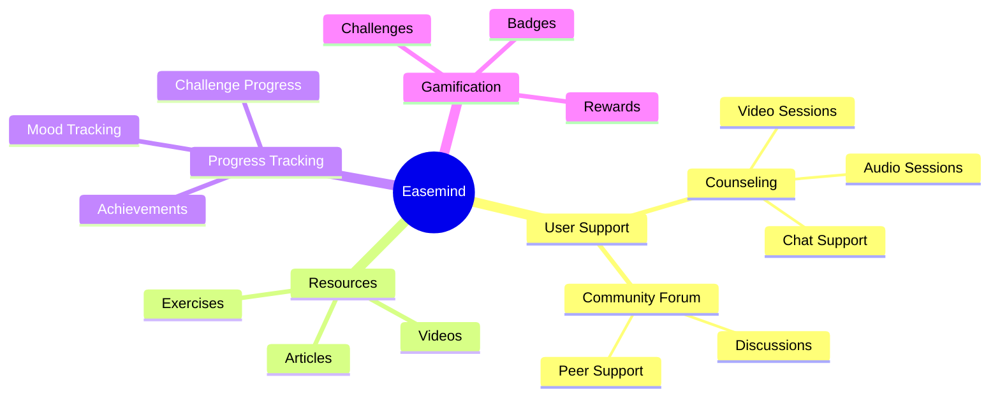

Easemind - A Mental Health Support Platform
Easemind is a one-stop mental health support platform, offering users resources, counseling services, and interactive aids to help them with their mental wellness journey.

Overview
Easemind offers holistic, comprehensive support for mental health:

Professional counseling services
Community forums for support
Educational resources 
Interactive challenges
Mood tracking 
Progress tracking 


# Website hosted link
https://easemind-ai.vercel.app/

## Workflow

**Overall Workflow**


1. **User Journey**
   ```mermaid
   graph TD
     A[User Sign Up] --> B[Initial Assessment]
     B --> C[Personalized Dashboard]
     C --> D[Access Services]
     D --> E[Track Progress]
     E --> F[Complete Challenges]
     F --> G[Earn Rewards]
     G --> D
   ```

2. **System Architecture**
   ```mermaid
   graph LR
     A[Frontend React App] --> B[API Layer]
     B --> C[Authentication]
     B --> D[Resource Management]
     B --> E[Challenge System]
     B --> F[Appointment Booking]
     B --> G[Progress Tracking]
   ```

## Concept Map


## Output Snapshot


## Workflow Snapshot


## Tech Stack

### Frontend
- React 18
- TypeScript
- Vite
- TailwindCSS
- shadcn/ui
- Lucide Icons
- React Router DOM
- React Hook Form
- Zod
- Recharts

### Development Tools
- ESLint
- PostCSS
- Autoprefixer

## Novel Features
1. Intelligent Mood Tracking
- Visual Mood Tracking Interface
- Visualisation of Historical Mood Data
- Mood Trend Recognition

2. Gamified Challenges
- Progressively Challenging Levels
- Reward System
- Achievement Badges
- Task-Based Progress Tracking

3. Resource Personalisation
- Content Filtering, Based on the Levels of Difficulty
- Progress Tracking
- Multimedia Content Support

4. Community Integration
- Moderated Forums
- Anonymous Posting Option
- Peer Support System

## Solution Architecture 

The platform is built with a modular architecture focusing on:

1. **Core Modules**
   - Authentication & Authorization
   - User Management
   - Resource Management
   - Challenge System
   - Appointment Booking
   - Progress Tracking

2. **API Integration**
   ```typescript
   // Authentication API
   authApi: {
     login(email: string, password: string): Promise<User>
     signup(userData: Partial<User>): Promise<User>
   }

   // Counselor API
   counselorApi: {
     getCounselors(): Promise<Counselor[]>
     getAvailability(counselorId: string, date: string): Promise<TimeSlot[]>
   }

   // Resource API
   resourceApi: {
     getResources(): Promise<Resource[]>
     getResourcesByType(type: string): Promise<Resource[]>
   }

   // Challenge API
   challengeApi: {
     getChallenges(): Promise<Challenge[]>
     startChallenge(challengeId: string): Promise<Challenge>
     updateProgress(challengeId: string, taskId: string, completed: boolean): Promise<void>
   }
   ```

## Installation Guide

1. **Prerequisites**
   - Node.js 18+
   - npm or yarn

2. **Clone the Repository**
   ```bash
   git clone https://github.com/your-username/Easemind.git
   cd ease-mind
   ```

3. **Install Dependencies**
   ```bash
   npm install
   ```

4. **Environment Setup**
   ```bash
   cp .env.example .env
   ```
   Update the environment variables as needed.

## Running the Application

1. **Development Mode**
   ```bash
   npm run dev
   ```
   Access the application at `http://localhost:5173`

2. **Build for Production**
   ```bash
   npm run build
   ```

3. **Preview Production Build**
   ```bash
   npm run preview
   ```

## API Documentation

### Authentication API

```typescript
interface AuthAPI {
  login(email: string, password: string): Promise<{ user: User }>;
  signup(userData: Partial<User>): Promise<{ user: User }>;
}
```

### Counselor API

```typescript
interface CounselorAPI {
  getCounselors(): Promise<Counselor[]>;
  getCounselor(id: string): Promise<Counselor | undefined>;
  getAvailability(counselorId: string, date: string): Promise<TimeSlot[]>;
}
```

### Appointment API

```typescript
interface AppointmentAPI {
  getAppointments(): Promise<Appointment[]>;
  bookAppointment(appointment: Partial<Appointment>): Promise<Appointment>;
}
```

### Resource API

```typescript
interface ResourceAPI {
  getResources(): Promise<Resource[]>;
  getResourcesByType(type: 'article' | 'video' | 'exercise'): Promise<Resource[]>;
}
```

### Challenge API

```typescript
interface ChallengeAPI {
  getChallenges(): Promise<Challenge[]>;
  getChallengesByCategory(category: 'upcoming' | 'ongoing'): Promise<Challenge[]>;
  getChallenge(id: string): Promise<Challenge | undefined>;
  startChallenge(challengeId: string): Promise<Challenge>;
  updateProgress(challengeId: string, taskId: string, completed: boolean): Promise<void>;
  getUserProgress(userId: string): Promise<{ challengeId: string; progress: number }[]>;
  getRewards(userId: string): Promise<{ points: number; badges: string[] }>;
}
```

## Contributing

1. Fork the repository
2. Create your feature branch (`git checkout -b feature/AmazingFeature`)
3. Commit your changes (`git commit -m 'Add some AmazingFeature'`)
4. Push to the branch (`git push origin feature/AmazingFeature`)
5. Open a Pull Request

